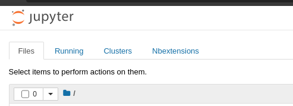
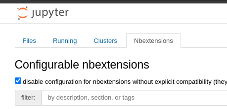
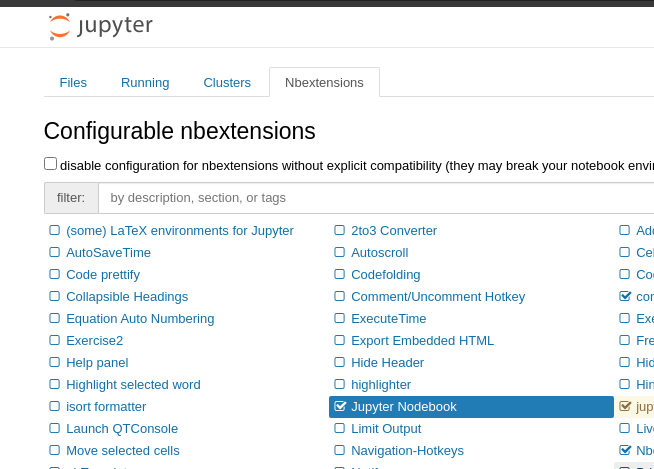

# Jupyter Flowbook
A Jupyter Notebook extension that turns cells into movable and resizable nodes in a flow-like visual programming language.

## Screenshots

## Installation

1. Run the following command to install the necessary tool for jupyter nbextensions

    ```$ pip install jupyter_contrib_nbextensions```

2. Clone this repo into `$CONDA_PREFIX/lib/python[version]/site-packages/jupyter_contrib_nbextensions/nbextensions/`, replacing the parts in brackets as necessary

3. Run this command to install the extension into the home jupyter directory

    ```$ jupyter contrib nbextensions install --user```
    
    or use the script `./jupyter_contrib_nbextensions_install_user.sh` in this repo


4. Start jupyter notebooks by running `$ jupyter notebook`

5. Open the jupyter notebook in a browser and select the 'Nbextensions' tab



6. Uncheck the disable option (if necessary)



7. Check 'Jupyter Flowbook' in the list of extensions to enable it



8. Open a jupyter notebook, or create a new one.


## How to use

This extension allows Jupyter Notebook cells to be dragged around the screen and resized like application windows on a desktop.

Pan around by clicking and dragging on a blank space, and zoom by scrolling in the blank space.

Wire nodes together by dragging from the input pin of one node to the output node of another or vice versa.

